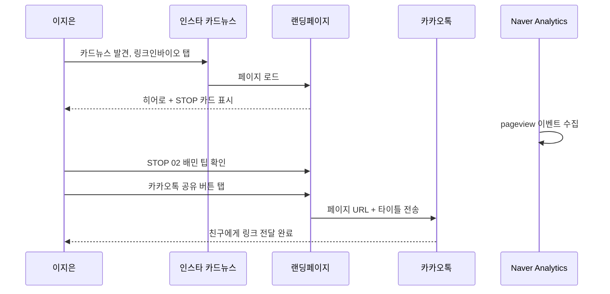
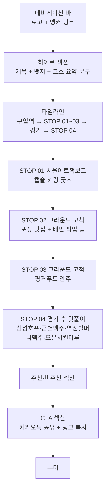
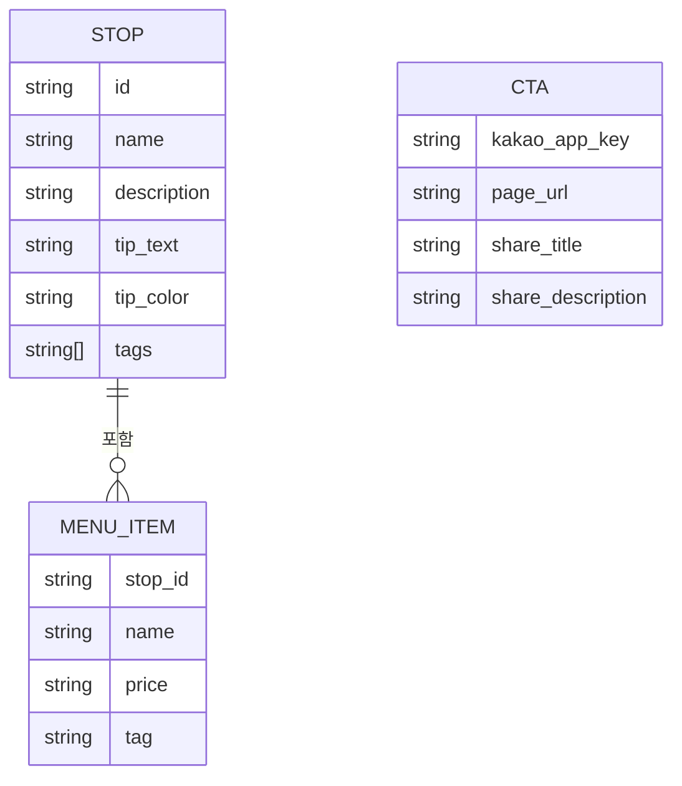

# 고척돔 먹킷리스트 PRD

> 작성일: 2026-06-03 · 버전: v1.0 · 작성자: 홍은경
> 다음 단계: FRD (`prd-고척돔먹킷리스트-20260603-handoff.md` 참조)

---

## 1. 한 문단 요약

고척돔 먹킷리스트는 키움 히어로즈 야구 경기를 보러 오는 2030대 커플·친구·원정 팬이 경기 시작 전 고척 스카이돔 인근에서 줄 없이, 맛있게 즐길 수 있는 4단계 코스를 소개하는 모바일 최적화 랜딩페이지다. 인스타그램 카드뉴스 링크인바이오를 통해 유입된 방문자가 한 페이지 스크롤만으로 서울아트책보고 굿즈 뽑기부터 그라운드 고척 포장 픽업, 핑거푸드 안주, 경기 후 뒷풀이까지 전체 동선을 확인하고, 카카오톡으로 동행인과 바로 공유할 수 있도록 설계한다.

개발 기간은 1~2주이며, 정적 HTML 파일 한 장을 Netlify에 배포하는 구조로 별도 서버나 DB가 필요 없다. 현재 가장 큰 리스크는 STOP 02·03 일부 음식 가격 정보가 현장 미확인 상태인 것으로, 배포 전 현장 방문 후 수기 업데이트가 반드시 선행되어야 한다.

---

## 2. 왜 만드는가

### 2.1 현재 어떻게 일하고 있나

고척 스카이돔을 처음 찾는 팬들은 경기 전날 또는 당일 오전 인스타그램·네이버 블로그에서 맛집·코스 정보를 찾는다. 현재는 단편적인 블로그 후기나 SNS 카드뉴스가 여러 채널에 흩어져 있어 동선 순서로 한눈에 파악하기 어렵다. 카드뉴스를 저장해도 재확인이 불편하고, 같이 갈 친구에게 공유할 수단이 마땅하지 않아 결국 "구일역 내려서 어디 가지?"라는 막막함을 겪게 된다.

### 2.2 무엇이 답답한가

핵심 불편은 두 가지다. 첫째, 구장 근처 장소 정보를 동선 순서(STOP 1→2→3→입장→뒷풀이)로 한눈에 보여주는 콘텐츠가 없다. 둘째, 배민 픽업처럼 "경기 1시간 전에 미리 주문해야 줄 없이 받을 수 있다"는 사전 행동 정보가 잘 알려지지 않아 도착 후 혼잡한 줄이나 구장 내 비싼 음식에 의존하게 된다.

### 2.3 우리가 어떻게 바꾸는가

인스타 카드뉴스와 연동된 전용 랜딩페이지를 만들어, 방문자가 링크를 눌렀을 때 4개 STOP 코스·배민 픽업 팁·뒷풀이 장소를 한 페이지에서 확인하게 한다. 카카오톡 공유 버튼을 함께 제공해 "나 혼자 저장"이 아닌 "동행인과 함께 계획"으로 전환 행동을 유도한다. 구로구 20년 기획자 권위를 히어로 섹션에 심어 처음 보는 방문자도 신뢰하고 따라오게 만든다.

---

## 3. 누가 쓰는가

이 페이지의 방문자는 인스타그램이나 블로그에서 고척돔 맛집·코스 정보를 찾다가 유입되는 사람들이다. 대부분 처음 고척돔을 방문하거나 원정 경기를 보러 온 팬이며, 모바일로 이동 중에 정보를 소비한다.

### 3.1 핵심 페르소나

| 변수 | 값 |
|---|---|
| 이름 / 나이 | 이지은, 27세 |
| 직업·역할 | 직장인 (서울 외 거주, 키움 원정 팬) |
| 디지털 숙련도 | 중상 — 인스타·배민·카카오톡 일상 사용 |
| 사용 기기 | iOS 스마트폰 |
| 사용 맥락 | 경기 당일 오전, 이동 중 정보 탐색. 연인 또는 친구와 동행 |
| 핵심 동기 | 구장 내 비싼 음식 피하기, 줄 서는 시간 아끼기 |
| 좌절 경험 | 경기 전 "어디 가지?" 막막함, 도착 후 혼잡한 대기줄에 당황 |
| 의사결정 기준 | 도보 5분 이내, 웨이팅 없음, 가격 명시, 사진·사례 보고 결정 |

### 3.2 비대상 사용자

경기 당일 구장으로 바로 직행하는 팬, 구장 주변을 이미 잘 아는 시즌권 보유자, PC 환경 방문자(보조 대상으로 최소 가독성만 확보)는 핵심 대상이 아니다.

---

## 4. 사용자 시나리오

이 랜딩페이지가 실제로 어떻게 쓰이는지 세 가지 상황을 보여준다.

### 시나리오 1: 인스타 카드뉴스 → 카카오 공유 → 동행 확정 (Happy Path)

이지은은 경기 이틀 전 인스타그램에서 "고척돔 먹킷리스트" 카드뉴스를 발견한다. 첫 슬라이드 문구에 관심이 생겨 프로필 링크인바이오를 탭한다. 랜딩페이지가 열리면 히어로 섹션의 "구로구 20년 기획자 추천"과 코스 요약이 눈에 들어오고, 스크롤하며 STOP 01~04 장소 카드를 읽는다. STOP 02에서 "배민 픽업 필수 — 경기 1시간 전 미리 주문"을 확인하고 배민 앱을 열어 즐겨찾기 추가한다. 페이지 하단 카카오톡 공유 버튼을 탭해 같이 갈 친구에게 페이지 링크를 보낸다.

### 시나리오 2: 네이버 블로그 검색 유입 → 링크 복사

이지은의 친구 수연은 네이버에서 "고척돔 경기 전 맛집"을 검색하다가 이 페이지 링크가 걸린 블로그 후기를 발견한다. 처음 보는 페이지지만 히어로 섹션의 "구로구 20년 기획자"와 STOP별 상세 내용에서 신뢰를 얻는다. 카카오톡이 아닌 다른 채널로 공유하고 싶어 "링크 복사" 버튼을 탭한다. 화면 상단에 "링크가 복사되었습니다!" 토스트 메시지가 나타나고, 수연은 인스타 DM으로 링크를 붙여넣는다.

### 시나리오 3: 경기 당일 이동 중 재확인

이지은이 경기 당일 구일역으로 이동하는 지하철 안에서 며칠 전 카카오톡으로 받은 링크를 다시 연다. 페이지가 빠르게 로드되고 STOP 01·02 정보를 재확인한다. STOP 04 뒷풀이 섹션에서 "경기 종료 직후 5분 골든타임" 경고를 보고 친구에게 미리 알린다. 인터넷이 불안정한 환경에서도 이미지가 작아 빠르게 로드된다.

---

## 5. 무엇을 만드는가

### 5.1 화면 구조

단일 URL의 단일 스크롤 페이지로 구성한다. 모든 콘텐츠가 세로 스크롤로 이어지며 별도 내비게이션이나 하위 페이지는 없다.

### 5.2 핵심 기능 설명

**페이지 콘텐츠 렌더링** — 히어로 섹션은 "구로구 20년 기획자 추천" 뱃지, 서비스명, 핵심 문구를 첫 화면에 표시한다. 그 아래 5단계 타임라인(구일역 출발 → STOP 01~03 → 경기 입장 → STOP 04)과 각 STOP별 섹션이 이어지며, 장소 카드(이름·설명·가격·태그)를 보여준다. STOP마다 팁 박스(배민 픽업·반입 정책·골든타임 경고)를 강조한다.

**CTA — 카카오톡 공유 + 링크 복사** — 페이지 최하단 CTA 섹션에 두 가지 주요 액션 버튼을 배치한다. 카카오톡 공유 버튼을 탭하면 Kakao JavaScript SDK를 통해 미리 설정된 타이틀·설명과 함께 페이지 URL이 카카오톡으로 전송된다. 링크 복사 버튼을 탭하면 URL이 클립보드에 복사되고 2초간 토스트 메시지("링크가 복사되었습니다!")가 노출된다.

**Naver Analytics 방문 추적** — `<head>` 태그에 Naver Analytics 스크립트를 삽입해 페이지뷰를 자동 수집한다. 배포 후 4주간 방문자 수·체류 시간·유입 경로를 모니터링한다.

**스크롤 페이드인 애니메이션** — IntersectionObserver를 사용해 각 섹션이 뷰포트에 진입할 때 opacity·translateY 애니메이션을 적용한다. 스크롤 경험 개선 및 콘텐츠 집중도를 높인다.

### 5.3 데이터 모델 개요

이 서비스는 정적 HTML 파일로 구성되므로 DB가 없다. 모든 콘텐츠는 HTML에 하드코딩되며, 가격·운영 정보 변경 시 파일을 직접 수정해 재배포한다.

---

## 6. 기술·운영·성공 지표

### 6.1 기술 스택

정적 HTML 단일 파일로 구성하며 별도 프레임워크·빌드 툴을 사용하지 않는다. Google Fonts CDN(Black Han Sans·Noto Sans KR)과 Font Awesome 6 CDN으로 폰트·아이콘을 로드한다. Kakao JS SDK는 공유 기능에 한해 사용하고, Naver Analytics 스크립트를 head에 삽입한다. 호스팅은 Netlify 무료 플랜을 사용한다.

### 6.2 외부 통합 요약

| 서비스 | 용도 | 인증 방식 | 비용 |
|---|---|---|---|
| Kakao JS SDK | 카카오톡 공유 | JavaScript 앱 키 | 무료 |
| Naver Analytics | 방문 분석 | 사이트 아이디 스크립트 | 무료 |
| Google Fonts CDN | 폰트 | CDN (인증 없음) | 무료 |
| Font Awesome 6 CDN | 아이콘 | CDN (인증 없음) | 무료 |
| Netlify | 호스팅·배포 | Git 연동 또는 드래그앤드롭 | 무료 (무료 플랜) |

### 6.3 비기능 요구사항

모바일 LTE 환경에서 첫 로드 3초 이내를 목표로 한다. 이미지는 WebP 변환 및 200KB 이하 압축을 원칙으로 하며, base64 인라인 이미지는 파일 크기에 주의한다. 크롬·사파리·삼성 인터넷 최신 버전에서 정상 작동해야 하며 모바일 뷰포트(360px~)를 우선한다.

### 6.4 성공 지표

| 지표 | 목표 | 측정 도구 |
|---|---|---|
| 월 방문자 수 | 500명 이상 | Naver Analytics |
| 카카오톡 공유 클릭률 | 방문자 대비 10% 이상 | 버튼 클릭 이벤트 |
| 평균 체류 시간 | 90초 이상 | Naver Analytics |
| 재방문율 | 15% 이상 | Naver Analytics |

### 6.5 향후 단계 (MVP 이후)

배포 후 4주 데이터를 확인하고 다음 확장 여부를 결정한다. v2 후보로는 카카오맵 핀 연동, 배민 픽업 딥링크, 경기 일정 자동 연동, 카카오 채널 QR 코드 삽입이 있다.

---

## 7. KPI · 적대적 검토

### 7.1 성공 기준

4주 후 Naver Analytics에서 카카오톡 공유 클릭률 10%, 평균 체류 시간 90초, 월 방문자 500명을 확인한다. 이 수치를 충족하면 v2 기능 개발을 검토한다.

### 7.2 리스크 · 대응

| 리스크 | 심각도 | 대응 |
|---|---|---|
| 음식 가격·운영시간 변동 | 높음 | 분기 1회 현장 확인 및 수기 업데이트 |
| Kakao SDK 앱 키 미발급 | 높음 | 배포 전 필수 발급 (developers.kakao.com) |
| 이미지 용량 과다 → 느린 로드 | 중간 | WebP 변환 및 200KB 이하 압축 |
| 구장 음식 반입 정책 변경 | 중간 | 공식 채널 링크 병행 표기 |

---

## 8. 다음 단계 · 미해결 항목

STOP 02·03의 일부 가격 정보("현장 확인" 표기)는 현장 방문 후 업데이트 필요하다. Kakao JS 앱 키와 Naver Analytics 사이트 아이디는 배포 전 발급·삽입해야 한다. 도메인 구매 여부는 트래픽 확인 후 결정한다.

FRD 작성 시 각 섹션별 Empty·Loading·Error 상태, 카카오 공유 실패 처리, 토스트 메시지 타이밍을 상세 정의한다. TRD 작성 시 Netlify 배포 절차, CDN 캐시 정책, 이미지 최적화 워크플로우를 확정한다.

---

## 부록 A. 적대적 검토

**🔴 HIGH — 가격 정보 신뢰성**: STOP 02·03 다수 메뉴의 가격이 "현장 확인" 상태다. 방문자가 믿고 갔다가 실제와 다르면 콘텐츠 신뢰도가 크게 떨어진다. 배포 전 현장 방문 및 가격 업데이트 필수.

**🔴 HIGH — Kakao SDK 미설정**: 현재 HTML에 "YOUR_KAKAO_APP_KEY" 플레이스홀더가 그대로 있다. 배포 전 앱 키 발급 및 교체하지 않으면 공유 버튼이 동작하지 않는다.

**🟡 MEDIUM — 구장 음식 반입 정책**: 고척 스카이돔의 외부 음식 반입 정책은 경기 시즌·운영 정책에 따라 변경될 수 있다. "반입 정책은 사전 확인 필수" 문구가 이미 있으나, 키움 공식 채널 링크를 팁 박스에 병행 표기하면 신뢰도를 높일 수 있다.

**🟡 MEDIUM — 이미지 파일 크기**: 현재 HTML에 base64 인코딩 이미지가 포함되어 있다. 파일 전체 크기가 커지면 모바일 LTE 환경에서 로드가 느려진다. 실사 이미지를 CDN(Cloudinary 등)으로 분리하고 WebP 200KB 이하로 압축하는 것을 권장한다.
